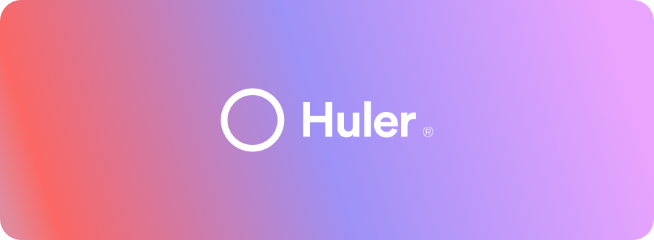

 

# Front End Developer Technical Challenge

👋  Hey There!

For this challenge, we'd like you to finish a new piece of functionality called "Huler Todo".

### **Overview**

Huler Todo is a simple todo list, featuring abilities to:

- Add a new todo
- Mark a todo as completed by checking it, or dragging it over to the completed list
- Ability to add sub-items
- When all sub-items are completed, the item itself should be complete

We've set up a [Codesandbox](https://codesandbox.io/s/huler-frontend-tech-challenge-wes4m) containing the existing work, we'd like you to fork and finish off the project by:

- Aligning it with the design as accurately as possible
- Get as much functionality above as you can working
- Tidy up any mistakes or errors that already exist in the code
- Add in some responsive styling so it works across all screen sizes

### **Design**

[https://xd.adobe.com/view/eb4bf5aa-6d11-4f8c-8d52-3eb5fc94a204-be18/](https://xd.adobe.com/view/eb4bf5aa-6d11-4f8c-8d52-3eb5fc94a204-be18/)

Open the Adobe XD link above to see the design. By clicking the ‘Specs’ icon on the right, you’ll be able to see fonts, assets and colours. You can download assets by clicking on them in the assets panel and clicking download, choosing a file type of your preference - some assets are already available in the public folder.

You can also click on elements within the design to see information about them like margins, colours and export information if it can be exported.

---

Again, you can find the sandbox here: [https://codesandbox.io/s/huler-frontend-tech-challenge-wes4m](https://codesandbox.io/s/huler-frontend-tech-challenge-wes4m)

Thank you for taking the time to complete our tech challenge, good luck!
